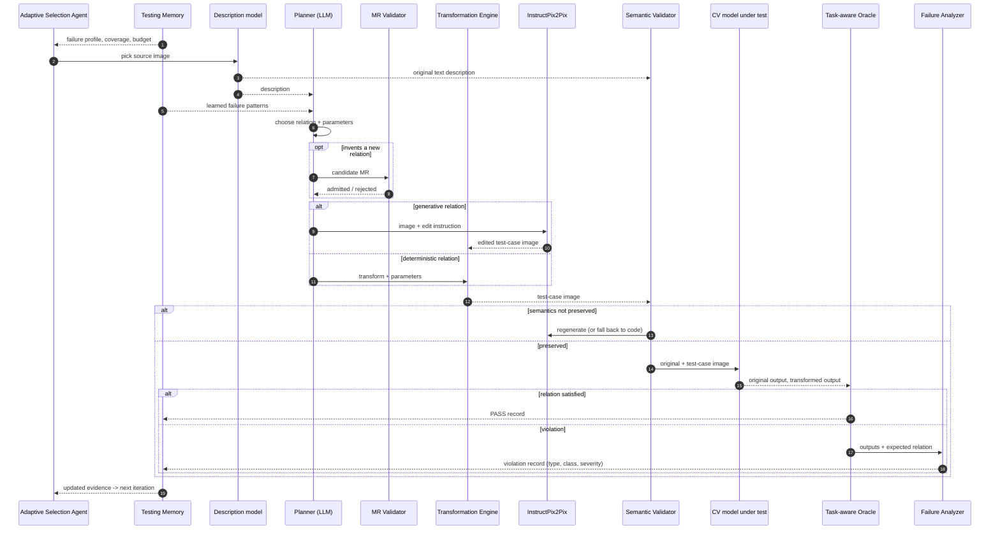

# Metamorph — Architecture & Project Flow

*Agentic Metamorphic Testing Framework for Computer Vision models.*

---

## 1. Inputs (from the user)

| Input | Purpose |
|---|---|
| **Trained CV model** | the system under test — attached through a **model adapter** (PyTorch / ONNX / Ultralytics / Hugging Face …) |
| **Task type** | `classification` \| `detection` \| `segmentation` \| `tracking` — selects the oracle and the expected-output relation |
| **Dataset** | source images (+ ground-truth annotations where available) |
| **Domain description** | plain-language text, e.g. *"urban driving; detects pedestrians, cars, cyclists, signs; must be robust to weather, lighting, camera and occlusion"* — drives **relation discovery** |
| Test budget / stopping criteria | max tests, target coverage, time budget, or failure-discovery saturation |

---

## 2. Outputs

* A **metamorphic robustness & coverage report** — per condition, per class, per relation type, with failure severity.
* The **testing memory** — every test as persistent, queryable evidence.
* All **generated test-case images** (original + transformed pairs), exportable.
* An **assessment** with an explicit caveat: *evidence, not a production-readiness guarantee.*

---

## 3. Phase 0 — Setup & baseline profiling

```
model + task + dataset + domain
        │
        ▼
  Model adapter attaches weights ──► inference session
        │
        ▼
  Model Profiler  ── runs the model on the original dataset
        │           computes task-appropriate metrics
        │           (detection: mAP, precision, recall, IoU, per-class AP, confidence stats)
        ▼
  Initial Failure Profile
    { task, baseline_map, weak_classes:[…], common_failures:[…], avg_confidence }
        │
        ▼
  Domain Parser  ── extracts the conditions that matter from the domain text
                    (weather · lighting · occlusion · camera · road environment …)
```

---

## 4. Phase 1 — Bootstrap sweep

> **Apply (almost) the whole general-purpose transformation library to a small set of sample images (~10) and store every result in memory.**

```
  Sample images (~10)
        │
        ▼
  Transformation Engine ── applies each base / general-purpose relation
        │                  (photometric · geometric · morphological + the fixed generative one)
        ▼
  Task-aware Oracle ── checks each transformed output against its relation
        │
        ▼
  Testing Memory  ◄── ~N transformed samples + verdicts written here
        │
        ▼
  Sweep analysis ── first failure pattern:
                    "early degradation under low visibility / night / occlusion"
```

This bootstrap gives the agent **evidence to reason from** before the adaptive loop starts — it is not blind on iteration 1.

---

## 5. Relation discovery & validation (runs once, before the loop; can re-run)

```
  Domain description + Task type + Model characteristics + Sweep failure pattern + Base MR library (21)
                                   │
                                   ▼
                        MR Discovery Agent (LLM)
                                   │
              ┌────────────────────┼─────────────────────┐
              ▼                    ▼                     ▼
        Base relations     Generative / environmental   Domain-specific
          (21, general)    (rain, fog, night, dusk,     (pedestrian → occluded,
                            haze, glare, motion blur,     dry road → wet road,
                            backlit, snow …)              car → truck, object insertion …)
              └────────────────────┼─────────────────────┘
                                   ▼
                             MR Validator  ── every candidate must pass:
                                   │           1. schema  (well-formed transform + relation)
                                   │           2. task compatibility
                                   │           3. domain consistency
                                   │           4. transformation feasibility
                                   │           5. expected output relation is defined & checkable
                                   │           6. semantic-preservation constraints stated
                                   ▼
                             MR Candidate Pool   (admitted; rejected ones logged, e.g. horizontal
                                                  flip — breaks left/right traffic semantics)
```

The pool is **dynamic**: the agent may synthesise **new** relations later from what memory has learned.

---

## 6. Phase 2 — The adaptive closed loop (one iteration)

```
                 ┌─────────────────────────────────────────────────────────┐
                 │                     TESTING MEMORY                       │
                 │  per test: source image · relation · category · params  │
                 │  · original output · transformed output · expected vs   │
                 │  actual relation · PASS/FAIL · failure type · affected  │
                 │  class · confidences · CLIP similarity                   │
                 │  aggregates: relation failure-rate · class failure-rate │
                 │  · parameter failure-rate · condition failure-rate      │
                 │  · relation coverage · image coverage                   │
                 └───────────────▲──────────────────────────┬──────────────┘
                                 │                          │ feeds
                                 │ writes back              ▼
   ①  Adaptive Selection Agent  ── uses: failure profile + memory + candidate pool
                                 │        + relation failure-rates + coverage
                                 │        + remaining budget
                                 ▼
   ①  Pick source image  +  ②  Describe it  ── vision / captioning model → text
                                 │              e.g. "urban road, 2 cars, 1 pedestrian"
                                 ▼
   ③  Plan relation  ── LLM chooses the next relation for THIS image, guided by memory
                        (may propose a NEW relation → back through the MR Validator)
                        output: { relation, transform, parameters, expected relation }
                                 │
                                 ▼
   ④  Generate test case  ──┬── generative relation → InstructPix2Pix
                            │      inputs: (original image, LLM edit instruction)
                            │      e.g. "add thick fog and reduce visibility"
                            └── deterministic relation → OpenCV / code transform
                                   (rotation, blur, brightness, occlusion overlay, insertion …)
                                 │
                                 ▼
   ⑤  Semantic check (CLIP)  ── compares the ORIGINAL image's text description
                                against the GENERATED test-case image
                                → "meaning preserved?"  (similarity ≥ threshold)
                            ┌── NOT preserved → regenerate  (or fall back to code) → back to ④
                            └── preserved → continue
                                 │
                                 ▼
   ⑥  Run CV model  ── inference on the original AND the test-case image
                                 │
                                 ▼
   ⑦  Verify (Task-aware Oracle)  ── does the transformed output satisfy the relation?
                                 │     invariant  O' ≈ O
                                 │     predictable  O' = T(O)   (e.g. boxes rotate with the image)
                                 │     addition  O' = O + Δ
                                 │     removal  O' = O − Δ
                                 │     relational  R(O, O') = true   (tracking, complex scenes)
                            ┌── PASS
                            └── FAIL → Failure Analyzer categorises it
                                        (confidence degradation · class confusion ·
                                         object disappearance · false negative ·
                                         localisation degradation · identity switch)
                                 │
                                 ▼
   ⑧  Update memory  ── store image · transform · parameters · verdict · failure detail
                                 │
                                 └──────────► loop:  Adaptive Selection Agent picks the next test
```

**Loop until** the stopping condition: `budget reached ∨ coverage achieved ∨ failure-discovery saturation ∨ time budget`.

---

## 7. Robustness profile (after the loop)

```
  Testing Memory  ──►  Profiler  ──►  MODEL ROBUSTNESS REPORT
                                      • baseline metrics vs metamorphic results
                                      • violation rate
                                      • robustness score per condition   (fog / night / occlusion …)
                                      • most problematic relations (ranked)
                                      • most affected class
                                      • most vulnerable conditions
                                      • relation-type & condition coverage
                                      • assessment  +  "not a production-readiness guarantee"
```

---

## 8. Module responsibilities

| Module | Responsibility | Nature |
|---|---|---|
| **Orchestrator** | drives the whole process; enforces the loop and stopping criteria | deterministic |
| **Model adapter** | uniform interface to the model under test across frameworks | deterministic |
| **Model Profiler** | baseline metrics + initial failure profile + final robustness profile | deterministic |
| **Domain Parser** | turn the domain text into a set of relevant conditions | LLM-assisted |
| **Bootstrap sweep** | apply the base library to sample images; seed memory | deterministic |
| **MR Discovery Agent** | propose generative / environmental / domain-specific relations; invent new ones from memory | **LLM** |
| **MR Validator** | 6-check screen; reject or send back for refinement | deterministic rules |
| **Adaptive Selection Agent** | choose the next *(image, relation, parameters)* from evidence + budget | **LLM / policy** |
| **Description model** | caption the source image → text for the CLIP check and the planner | VLM |
| **Transformation Engine** | run the chosen transform — deterministic code branch | deterministic |
| **Generative service** | instruction-conditioned image editing | **InstructPix2Pix** |
| **Semantic Validator** | image ↔ text similarity gate; trigger regenerate / fallback | **CLIP** |
| **Task-aware Oracle** | objectively decide whether the relation held, per task | **deterministic** |
| **Failure Analyzer** | categorise and describe each violation | deterministic + summary |
| **Testing Memory** | persistent evidence store + aggregate statistics | deterministic |

---

## 9. GenAI boundary (state this explicitly)

* **GenAI proposes and edits** — the MR Discovery Agent, the Adaptive Selection Agent, and InstructPix2Pix. **Every GenAI output is validated** (the MR Validator, the CLIP gate) and can be rejected.
* **The oracle, the metrics, and every PASS/FAIL decision are deterministic code.** The LLM is never the source of truth for a verdict.
* Third-party components (dataset, LLM, InstructPix2Pix, CLIP) are open / research-licensed and isolated behind interfaces. The **framework, agents, validators, oracles, orchestration and UI** are the group's own work.

---

## 10. One-line summary of the flow

> **Profile the model → sweep the base transformations into memory → discover & validate domain relations →
> then loop: pick an image, describe it, let the LLM plan the next relation from memory, generate the test case
> (InstructPix2Pix or code), gate it through CLIP, run the model, and let a task-aware oracle decide if the
> relation held — writing every result back to memory to steer the next test — until the budget is spent,
> then compile the robustness report.**


---

## 11. Mermaid diagrams

### 11.1  Full architecture (flowchart)

```mermaid
flowchart TD
    U["User inputs<br/>model · task · dataset · domain · test budget"]:::io

    %% ---------------- Phase 0 ----------------
    subgraph P0["Phase 0 — Setup and baseline profiling"]
        direction TB
        ADP["Model Adapter<br/>PyTorch / ONNX / Ultralytics / HF"]:::det
        PROF["Model Profiler<br/>metrics on the original dataset"]:::det
        FP["Initial Failure Profile<br/>weak classes · common failures · avg confidence"]:::data
        DOM["Domain Parser"]:::llm
        COND["Relevant conditions<br/>weather · lighting · occlusion · camera"]:::data
        ADP --> PROF --> FP
        DOM --> COND
    end

    %% ---------------- Phase 1 ----------------
    subgraph P1["Phase 1 — Bootstrap sweep"]
        direction TB
        SAMP["~10 sample images"]:::data
        TE0["Transformation Engine<br/>base / general-purpose library"]:::det
        OR0["Task-aware Oracle"]:::det
        PAT["Sweep failure pattern"]:::data
        SAMP --> TE0 --> OR0
        OR0 --> PAT
    end

    %% ---------------- Discovery ----------------
    subgraph DISC["Relation discovery and validation"]
        direction TB
        MRD["MR Discovery Agent (LLM)"]:::llm
        BASE["Base MRs (21)"]:::data
        GENM["Generative / environmental MRs<br/>rain · fog · night · dusk · haze · glare · motion blur"]:::data
        DMRM["Domain-specific MRs<br/>occluded pedestrian · wet road · car to truck · insertion"]:::data
        VAL["MR Validator<br/>schema · task · domain · feasibility · relation · semantics"]:::det
        POOL["MR Candidate Pool"]:::data
        MRD --> BASE
        MRD --> GENM
        MRD --> DMRM
        BASE --> VAL
        GENM --> VAL
        DMRM --> VAL
        VAL -- admitted --> POOL
        VAL -- rejected --> MRD
    end

    %% ---------------- Phase 2: closed loop ----------------
    subgraph LOOP["Phase 2 — Adaptive closed loop"]
        direction TB
        MEM[("Testing Memory<br/>image · relation · params · outputs · verdict ·<br/>failure type · class · confidences · CLIP sim ·<br/>aggregates: fail-rates · coverage")]:::mem
        SEL["Adaptive Selection Agent (LLM / policy)"]:::llm
        PICK["Pick source image"]:::det
        DESC["Describe image<br/>vision model to text"]:::vlm
        PLAN["Plan relation (LLM)<br/>choose or invent the next MR"]:::llm
        GENQ{"Generative<br/>relation?"}:::dec
        IP2P["InstructPix2Pix<br/>edit(image, instruction)"]:::gen
        CODE["Deterministic transform<br/>OpenCV / code"]:::det
        TC["Test-case image"]:::data
        CLIPQ{"CLIP semantic check<br/>original text vs test image"}:::clip
        RUN["Run CV model<br/>original and test case"]:::model
        ORA["Verify — Task-aware Oracle<br/>invariant · predictable · addition · removal · relational"]:::det
        PASS(["PASS"]):::pass
        VIOL(["VIOLATION"]):::fail
        FA["Failure Analyzer<br/>categorise the violation"]:::det

        SEL --> PICK --> DESC --> PLAN --> GENQ
        PLAN -. new MR .-> VAL
        GENQ -- yes --> IP2P --> TC
        GENQ -- no --> CODE --> TC
        TC --> CLIPQ
        CLIPQ -- not preserved --> IP2P
        DESC -. original description .-> CLIPQ
        CLIPQ -- preserved --> RUN --> ORA
        ORA --> PASS
        ORA --> VIOL --> FA
        PASS --> MEM
        FA --> MEM
        MEM --> SEL
    end

    STOP{"Stop?<br/>budget · coverage · saturation · time"}:::dec
    RPT["Model Robustness Report<br/>per condition · class · relation · coverage +<br/>assessment (not a production-readiness guarantee)"]:::io

    %% ---------------- cross-phase edges ----------------
    U --> ADP
    U --> DOM
    FP --> SAMP
    OR0 --> MEM
    FP --> MRD
    COND --> MRD
    PAT --> MRD
    POOL --> SEL
    FP --> SEL
    MEM --> STOP
    STOP -- no --> SEL
    STOP -- yes --> RPT

    %% ---------------- styling ----------------
    classDef io fill:#e8eefc,stroke:#3550a0,color:#12203f;
    classDef det fill:#eef2f7,stroke:#8a97a8,color:#1a1f26;
    classDef data fill:#f6f7f9,stroke:#cfd4db,color:#5b6675;
    classDef llm fill:#efeafc,stroke:#6a5acd,color:#3a2f7a;
    classDef gen fill:#efeafc,stroke:#6a5acd,color:#3a2f7a;
    classDef vlm fill:#efeafc,stroke:#6a5acd,color:#3a2f7a;
    classDef clip fill:#fff3e0,stroke:#b9791a,color:#6b4a10;
    classDef model fill:#e7f2ff,stroke:#2f6bff,color:#12356b;
    classDef mem fill:#eef7f0,stroke:#1f9d63,color:#0f4a2e;
    classDef pass fill:#e7f6ee,stroke:#1f9d63,color:#0f4a2e;
    classDef fail fill:#fdeaea,stroke:#d6323a,color:#7a1c20;
    classDef dec fill:#f5f6f8,stroke:#5b6675,color:#1a1f26;
```



### 11.2  One adaptive iteration (sequence)


